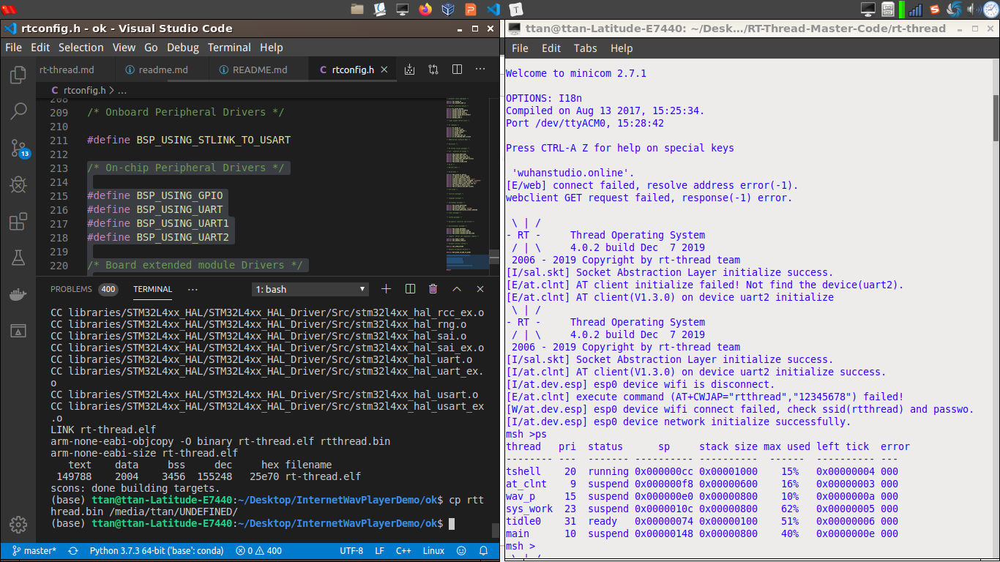
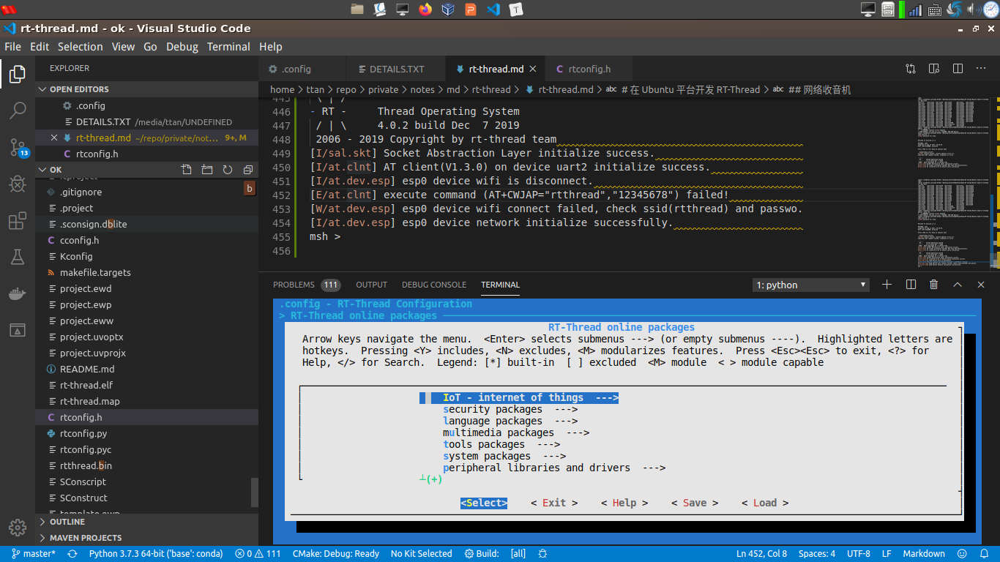

# STM32L475 潘多拉开发板 BSP 说明(Linux-Ubuntu)


RT-Thread 官方代码为 Windows 系统下准备. 本代码在其基础上做了适当修改可以在 Linux 系统编译,下载运行.

主要修改如下:
- `Kconfig` 文件换行符从 `CRLF` 改为 `LF`
- 设置 `gcc-arm-none-eabi` 编译器本地安装路径, 本代码默认如下

    ```Python 
    EXEC_PATH = r'/opt/gcc-arm-none-eabi-6_2-2016q4/bin'
    ```

## 配置编译器环境

请参考[在 Ubuntu 平台开发 RT-Thread](https://rt-thread-linux.netlify.com/)

## 编译
在代码根目录执行依次如下命令:

- 配置
  
  参考原文档开启相关 LCD, UART 等功能.

```Shell
$ scons --menuconfig
```

以上命令会掉出如下配置界面:



根据所选模块, 部分源代码文件会相应修改源代码.

如果运行出现 warning, 可能是新生成的文件重置了文件换行符, 需再次改变提到文件换行符 从`CRLF` 到 `LF`

- 编译
  
```Shell
$ scons
```

以上命令调用 GCC 编译器编译源代码,生成 `rtthread.bin` 镜像文件供烧录.

- 烧录

```Shell
$ cp rtthread.bin /media/<current-user>/UNDEFINED/

RT-Thread 4.0+ 会内置 UMS(USB Mass Storage) 功能, 也就是通过USB 接上电脑后,会把自己 `mount` 成一个 USB 硬盘. 烧录只需要执行 `cp`命令就可以了.

如果一切顺利,会看到下载,运行的指示 LED 会相继点亮.

- 监控

可以通过 [minicom](https://www.jianshu.com/p/f881386afdda) 实时监控开发版运行情况.

- 安装 minicom

```Shell
$ sudo apt-get install minicom
```

- 查找当前连接开发板 USB 端口名称

```Shell
$ dmesg | grep tty 
[    0.000000] console [tty0] enabled
[ 4369.356257] cdc_acm 2-1:1.2: ttyACM0: USB ACM device
```
以上命令结果显示 当前设备名为 `ttyACM0`

- 配置 minicom 

```Shell
$ sudo minicom -s
```

在以上命令中修改
    - 选择 `Serial port setup`
    - 再按 `a`，
    - 修改 `serial device` 值为上一步的串口设备名,比如 `ttyACM0`
    - 按 `Enter` 回到菜单页，
    - 选择 `save as dfl` 保存设置
    - 退出

如果出现信息则表示成功连接通讯, 而且开发板连接上 WIFI 正常工作.

```Shell
Welcome to minicom 2.7.1

OPTIONS: I18n                                                                
Compiled on Aug 13 2017, 15:25:34.                                           
Port /dev/ttyACM0, 15:28:42                                                  
                                                                             
Press CTRL-A Z for help on special keys 

 \ | /                                                                          
- RT -     Thread Operating System                                              
 / | \     4.0.2 build Dec  7 2019                                              
 2006 - 2019 Copyright by rt-thread team                                        
[I/sal.skt] Socket Abstraction Layer initialize success.                        
[I/at.clnt] AT client(V1.3.0) on device uart2 initialize success.               
[I/at.dev.esp] esp0 device wifi is connected.                                   
[I/at.dev.esp] esp0 device network initialize successfully.                     
msh >ps                                                                         
thread   pri  status      sp     stack size max used left tick  error           
-------- ---  ------- ---------- ----------  ------  ---------- ---             
tshell    20  running 0x000000cc 0x00001000    15%   0x0000000a 000             
at_clnt    9  suspend 0x000000f8 0x00000600    67%   0x00000005 000             
wav_p     15  suspend 0x000000e0 0x00000800    10%   0x0000000a 000             
sys_work  23  suspend 0x0000010c 0x00000800    62%   0x00000002 000             
tidle0    31  ready   0x0000005c 0x00000100    51%   0x00000012 000             
main      10  suspend 0x00000148 0x00000800    40%   0x0000000b 000             
msh >                                  


CTRL-A Z for help | 115200 8N1 | NOR | Minicom 2.7.1 | VT102 | Offline | tyACM0
```

## 可能故障

- 没有在 `menuconfig` 配置阶段打开 `UART2`, 导致 ATK-ESP8266 不能接收 AT 指令
```Shell            
 \ | /                                                                          
- RT -     Thread Operating System                                              
 / | \     4.0.2 build Dec  7 2019                                              
 2006 - 2019 Copyright by rt-thread team                                        
[I/sal.skt] Socket Abstraction Layer initialize success.                        
[E/at.clnt] AT client initialize failed! Not find the device(uart2).            
[E/at.clnt] AT client(V1.3.0) on device uart2 initialize failed(-1).            
[E/at.dev.esp] get AT client(uart2) failed.                                     
msh >
```

- 没有在 `menuconfig` 配置阶段设置正确的 WIFI 热点名称和密码

```Shell
 \ | /
- RT -     Thread Operating System
 / | \     4.0.2 build Dec  7 2019
 2006 - 2019 Copyright by rt-thread team                                        
[I/sal.skt] Socket Abstraction Layer initialize success.                        
[I/at.clnt] AT client(V1.3.0) on device uart2 initialize success.               
[I/at.dev.esp] esp0 device wifi is disconnect.                                  
[E/at.clnt] execute command (AT+CWJAP="rtthread","12345678") failed!            
[W/at.dev.esp] esp0 device wifi connect failed, check ssid(rtthread) and passwo.
[I/at.dev.esp] esp0 device network initialize successfully.                     
msh >
```

-----------------------------------------------------
原文档如下


## 简介

本文档为 RT-Thread 开发团队为 STM32L475 潘多拉开发板提供的 BSP (板级支持包) 说明。

主要内容如下：

- 开发板资源介绍
- BSP 快速上手
- 进阶使用方法

通过阅读快速上手章节开发者可以快速地上手该 BSP，将 RT-Thread 运行在开发板上。在进阶使用指南章节，将会介绍更多高级功能，帮助开发者利用 RT-Thread 驱动更多板载资源。

## 开发板介绍

潘多拉 STM32L475 是正点原子推出的一款基于 ARM Cortex-M4 内核的开发板，最高主频为 80Mhz，该开发板具有丰富的板载资源，可以充分发挥 STM32L475 的芯片性能。

开发板外观如下图所示：


该开发板常用 **板载资源** 如下：

- MCU：STM32L475VET6，主频 80MHz，512KB FLASH ，128KB RAM
- 外部 FLASH：W25Q128（SPI，16MB）
- 常用外设
  - RGB 状态指示灯：1个，（红、绿、蓝三色）
  - 按键：4个，KEY_UP（兼具唤醒功能，PC13），K0（PD10），K1（PD9），K2（PD8）
  - 红外发射头，红外接收头
  - 有源蜂鸣器：1个
  - 光环境传感器：1个
  - 贴片电机：1个
  - 六轴传感器：1个
  - 高性能音频解码芯片：1个
  - 温湿度传感器（AHT10）：1个
  - TFTLCD 显示屏：1个
  - WIFI 模块（AP6181）：1个
  - 板载 ST LINK V2.1 功能
- 常用接口：SD 卡接口、USB OTG Micro USB 接口
- 调试接口，ST-LINK Micro USB 接口

开发板更多详细信息请参考正点原子 [STM32 潘多拉开发板介绍](https://eboard.taobao.com/index.htm)。

## 外设支持

本 BSP 目前对外设的支持情况如下：

| **板载外设**      | **支持情况** | **备注**                              |
| :----------------- | :----------: | :------------------------------ |
| 板载 ST-LINK 转串口 |     支持     |                                    |
| QSPI_FLASH         |     支持     |                                   |
| SD卡               |   支持       | 使用 SPI1 驱动 |
| 温湿度传感器        |    支持     |                             |
| 六轴传感器         |    支持     |                              |
| 音频解码           |    支持     |                                     |
| TFTLCD           |    支持     | 使用 SPI3 驱动 |
| 贴片电机           |    暂不支持     |即将支持                      |
| 光环境传感器       |    暂不支持     |即将支持                           |
| **片上外设**      | **支持情况** | **备注**                              |
| GPIO              |     支持     |                                      |
| UART              |     支持     |                                      |
| SPI               |     支持     |                                      |
| QSPI              |     支持     |                                      |
| I2C               |     支持     |                                      |
| TIM               |     支持     |                                      |
| ADC               |     支持     |                                      |
| RTC               |     支持     | 支持外部晶振和内部低速时钟 |
| WDT               |     支持     |                                      |
| PWM               |     支持     |                                      |
| USB Device        |   暂不支持   | 即将支持                              |
| USB Host          |   暂不支持   | 即将支持                              |
| **扩展模块**      | **支持情况** | **备注**                              |
| NRF24L01 模块  |     支持    | 根据实际板子接线情况修改 NRF24L01 软件包中的 `NRF24L01_CE_PIN` 和 `NRF24_IRQ_PIN` 的宏定义，以及 SPI 设备名 |
| ATK-ESP8266 模块  |    暂不支持  | 即将支持                              |
| enc28j60 模块  |     暂不支持    | 即将支持                              |
使用该开发板的更多高级功能请参考 RT-Thread 代码仓库： [RT-Thread IoT-Board SDK](https://github.com/RT-Thread/IoT_Board)。

## 使用说明

使用说明分为如下两个章节：

- 快速上手

    本章节是为刚接触 RT-Thread 的新手准备的使用说明，遵循简单的步骤即可将 RT-Thread 操作系统运行在该开发板上，看到实验效果 。

- 进阶使用

    本章节是为需要在 RT-Thread 操作系统上使用更多开发板资源的开发者准备的。通过使用 ENV 工具对 BSP 进行配置，可以开启更多板载资源，实现更多高级功能。


### 快速上手

本 BSP 为开发者提供 MDK4、MDK5 和 IAR 工程，并且支持 GCC 开发环境。下面以 MDK5 开发环境为例，介绍如何将系统运行起来。

#### 硬件连接

使用数据线连接开发板到 PC，打开电源开关。

#### 编译下载

双击 project.uvprojx 文件，打开 MDK5 工程，编译并下载程序到开发板。

> 工程默认配置使用板载 ST-LINK 下载程序，只需一根 USB 线连接开发板，点击下载按钮即可下载程序到开发板

#### 运行结果

下载程序成功之后，系统会自动运行，观察开发板上 LED 的运行效果，红色 LED 会周期性闪烁。

连接开发板对应串口到 PC , 在终端工具里打开相应的串口（115200-8-1-N），复位设备后，可以看到 RT-Thread 的输出信息:


```bash
 \ | /
- RT -     Thread Operating System
 / | \     3.1.1 build Nov 19 2018
 2006 - 2018 Copyright by rt-thread team
msh >
```
### 进阶使用

此 BSP 默认只开启了 GPIO 和 串口1 的功能，如果需使用 SD 卡、Flash 等更多高级功能，需要利用 ENV 工具对BSP 进行配置，步骤如下：

1. 在 bsp 下打开 env 工具。

2. 输入`menuconfig`命令配置工程，配置好之后保存退出。

3. 输入`pkgs --update`命令更新软件包。

4. 输入`scons --target=mdk4/mdk5/iar` 命令重新生成工程。

本章节更多详细的介绍请参考 [STM32 系列 BSP 外设驱动使用教程](../docs/STM32系列BSP外设驱动使用教程.md)。

## 注意事项

暂无

## 联系人信息

维护人:

- [SummerGift](https://github.com/SummerGGift)